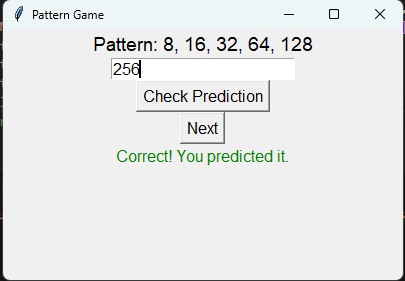

# Pattern Prediction Game

[](https://www.python.org/downloads/)

## Overview

The Pattern Prediction Game is an interactive Python application that challenges players to predict the next number in a sequence based on various mathematical patterns. It's a fun and educational way to test and improve your pattern recognition skills. Whether you're a math enthusiast or just looking for an entertaining game, this project is for you!



## Features

- **Diverse Patterns**: The game offers a variety of mathematical patterns, including increasing sequences, prime numbers, geometric progressions, and more.

- **Custom Challenges**: Some patterns include adjustable parameters, allowing for custom challenges. For example, you can choose the common difference in arithmetic progressions or the growth factor in exponential patterns.

- **Instant Feedback**: Receive instant feedback on the correctness of your predictions. Green for correct, red for incorrect.

- **User-Friendly Interface**: The simple and intuitive user interface is built with the Tkinter library, making it easy to jump right into the game.

## How to Play

1. **Clone the Repository**: Start by cloning this repository to your local machine.

   ```bash
   git clone https://github.com/Rahul5021/pattern-prediction-game.git
2.Navigate to the Directory: Change your working directory to the cloned repository.
    
    cd pattern-prediction-game
    
3.Run the Game: Execute the Python script to start the game.
  
     python pattern_game.py

4.Guess the Next Number: Observe the current number sequence displayed on the screen. Enter your prediction for the next number in the sequence.

5.Check Your Prediction: Click the "Check Prediction" button to see if your guess is correct. You'll receive instant feedback.

6.Repeat and Improve: Keep playing to test and improve your pattern recognition skills.

Contribution
Contributions are welcome! If you'd like to improve the game, add new features, or fix issues, please fork the repository and create a pull request.

License
This project is licensed under the MIT License - see the LICENSE file for details.

Acknowledgments
Special thanks to the Tkinter library for providing the user interface components.
Inspiration for pattern ideas from various mathematical concepts.

Author
Rahul Agrawal

Contact
If you have any questions or suggestions, feel free to reach out to agrawal.rahul.1025@gmail.com .
